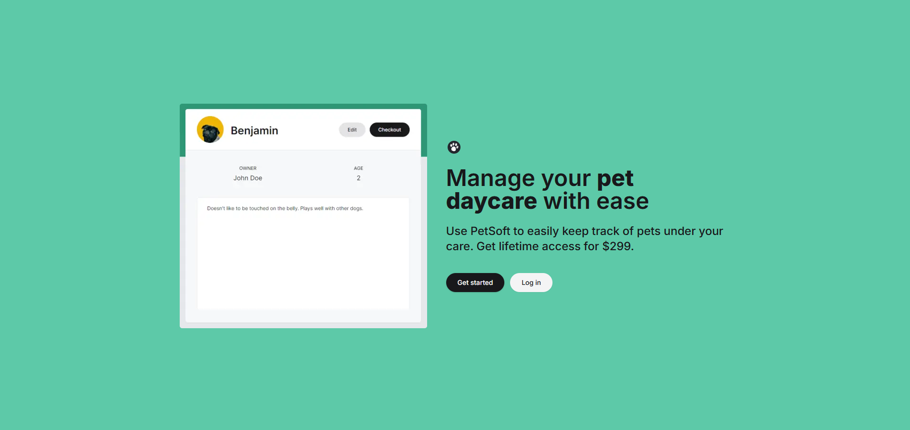
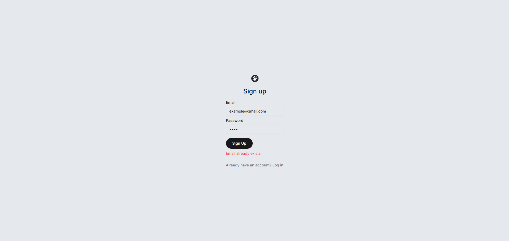
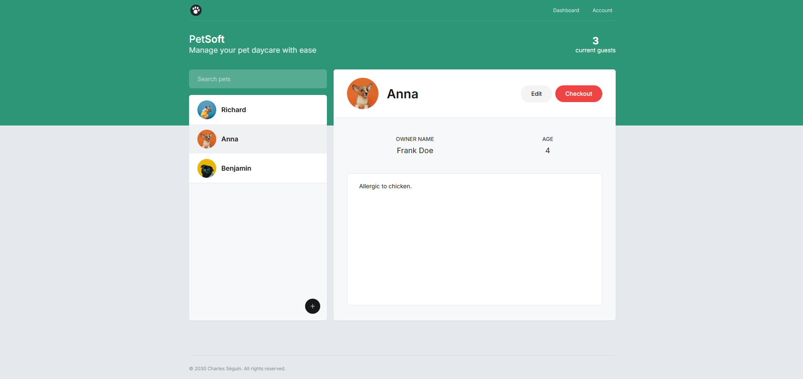
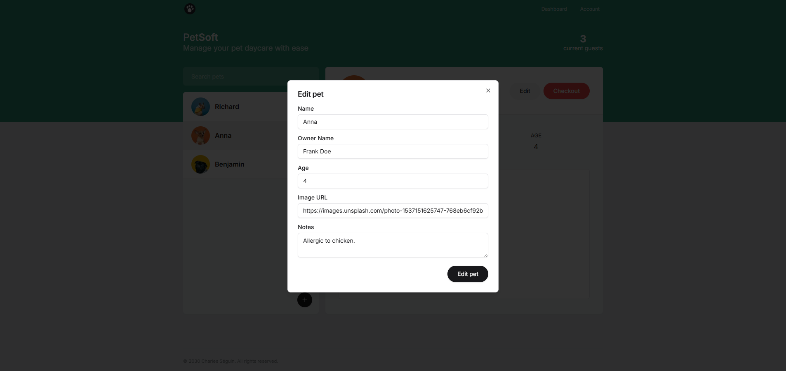
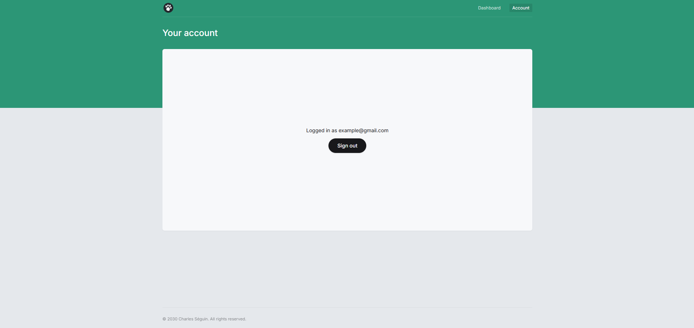

# 🐶 Petsoft

[Live Demo](https://petsoft-omega-ivory.vercel.app/)

**Petsoft** est une application web pour les cliniques vétérinaires. Elle permet de gérer les clients, les animaux, les rendez-vous et plus encore.

---

## 🚀 Technologies utilisées

- [React](https://react.dev/)
- [Next.js](https://nextjs.org/)
- [TypeScript](https://www.typescriptlang.org/)
- [TailwindCSS](https://tailwindcss.com/)
- [Shadcn UI](https://ui.shadcn.com/)
- [Auth.js](https://authjs.dev/)
- [Stripe](https://stripe.com/)
- [Prisma](https://www.prisma.io/)
- [Supabase](https://supabase.io/)
- [Vercel](https://vercel.com/)

---

## ✨ Fonctionnalités principales

- Gestion des clients & profils d’animaux
- Interface d’administration
- Authentification
- Système de paiement
- Interface responsive

---

## 📸 Aperçus

### 🏠 Page d’accueil


### 🔐 Connexion/Inscription




### 💳 Paiement


### 📊 Tableau de bord




---

## 📂 Installation locale

```bash
git clone https://github.com/MisterCharlO/petsoft.git
cd petsoft
npm install
npm run dev
